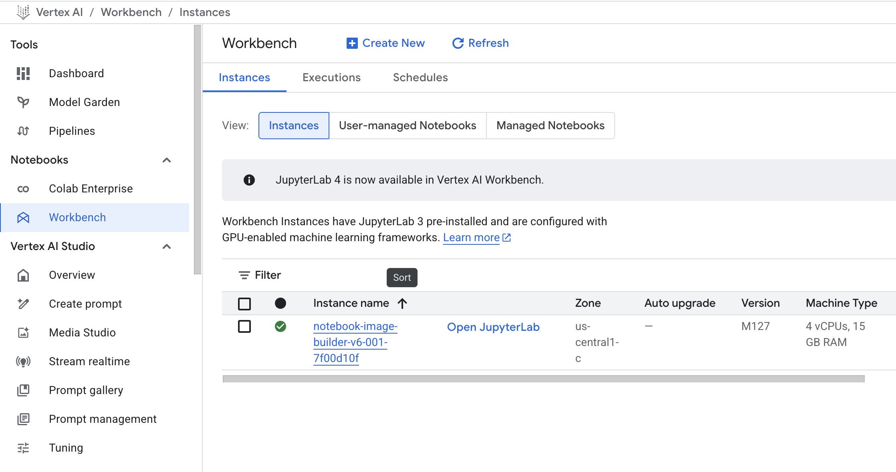
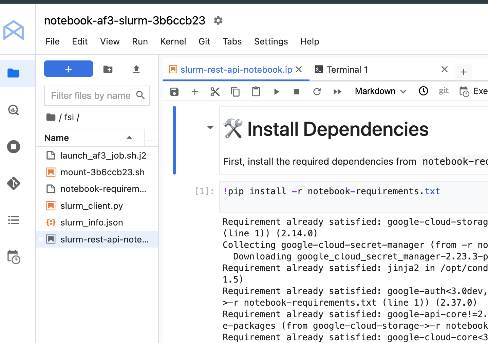
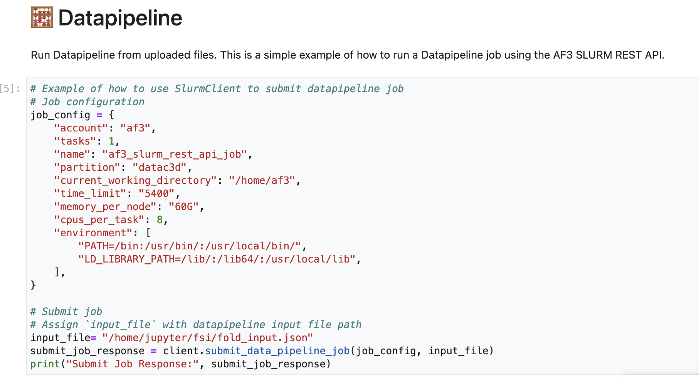

# Simple Ipynb Launcher

The Simple ipynb Launcher is a Jupyter Notebook-based interface designed to streamline the process of running AlphaFold 3 jobs through a SLURM-based cluster using the SLURM REST API.

It allows users to:
* Upload AlphaFold 3 input files (see [AlphaFold 3 Input Documentation](https://github.com/google-deepmind/alphafold3/blob/main/docs/input.md)),
* Launch data pipeline and/or inference jobs, and
* View and validate output files — all within a Jupyter Notebook environment.

This launcher is automatically included when deploying the AlphaFold 3 blueprint with the `af3slurmrestapi_activate` flag set to `true`.

## Launcher Logic
1.  **Folder sharing:** Mounts a bucket as a shared storage folder, allowing users to upload input files (for data pipeline or inference) directly to the notebook.
2.  **Job Execution:** The data pipeline or inference job is executed on the SLURM partition via a SLURM REST API request.
3.  **Result Storage:** Upon successful completion, the outputs are stored in the shared folder within the bucket, enabling users to validate the result files.
4. **Secret Manager:** After deployment, a secret token retrieved from the SLURM Controller is automatically uploaded to Google Secret Manager. This securely stores the token required for SLURM REST API operations.

## How It Works
1. **Shared Folder Setup:**
A cloud storage bucket is mounted to the notebook environment as a shared folder. Users upload their input files here.

2. **Job Submission:**
Jobs (either data pipeline or inference) are submitted via SLURM using its REST API interface.

3. **Result Output:**
Once a job is completed, results are saved back into the shared folder for easy access and validation.

4. **Secure Token Handling:**
A token required for authenticating with the SLURM REST API is retrieved and automatically stored in Google Secret Manager during deployment. 

## Getting started
After deploying the AlphaFold 3 blueprint on Vertex AI Workbench, the notebook will be accessible from the workbench interface.

> NOTE: Make sure the SLURM nodes complete their startup scripts before attempting to run jobs. Also have all prerequsite, such as datapipeline `hydration` process is completed

### Access Jupyter Notebook

Once deployment is complete, open the Jupyter Notebook from the AI Vertex Workbench:

If the deployment is successful and Slurm nodes startup-scripts are succeed, You’ll see a file structure similar to this:

### Running a Job

When you open the notebook, you’ll find different sections containing relevant information. 
1. **Install Dependencies**  
   The first section of the notebook installs required packages from `requirements.txt`.

2. **Configure Parameters**  
   Settings (e.g., for SLURM job submission or data pipeline configuration) are mostly auto-filled based on blueprint variables. You can adjust them as needed.

3. **Submit a Job**  
   The section demonstrates how to send a job to the SLURM controller.  
   For example of `Datapipeline` job submission, it includes the payload and settings needed to send a data pipeline job to the working node.

## Custom configuration

You can customize settings via blueprint variables before deployment. If modifications are needed later, ensure:

* All required resources are available,
* Configuration changes are validated within the notebook before submitting new jobs.

