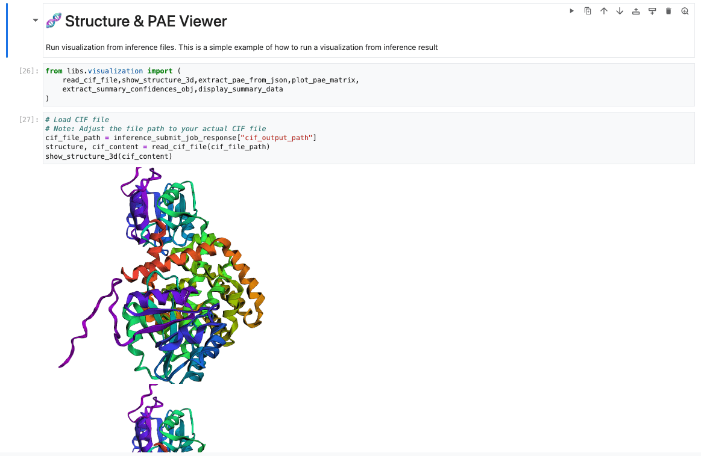

# Simple Ipynb Launcher

The Simple Ipynb Launcher is a Jupyter Notebook-based interface designed to streamline the process of running AlphaFold 3 jobs through a SLURM-based cluster using the SLURM REST API.

It allows users to:
* Upload AlphaFold 3 input files (see [AlphaFold 3 Input Documentation](https://github.com/google-deepmind/alphafold3/blob/main/docs/input.md)),
* Launch data pipeline and/or inference jobs, and
* View and validate output files — all within a Jupyter Notebook environment.

To enable and start the Slurm REST API Simple Service, ensure that the following settings are present in your `af3-slurm-deployment.yaml` file:

```yaml
af3ipynb_activate: true
af3ipynb_bucket: "<your-bucket>"
af3ipynb_user: af3ipynb
```
**Important:** We recommend using a Cluster Toolkit version v1.48.0.

## Important Note: Startup Script Completion Before Slurm API Requests

To ensure proper initialization of the cluster, the system is configured to wait for the successful completion of startup scripts on all relevant nodes (including login nodes and controller nodes) before submitting any Slurm API requests.

**How to Verify Startup Script Completion:**

You can check the `/var/log/slurm/setup.log` file on each node to confirm the successful execution of the startup script. Look for one of the following log entries, indicating completion for the respective node type:

* **Login Node Completion:**
    ```
    INFO: Done setting up login
    ```
    This message confirms that the startup script on a login node has finished its configuration.

* **Controller Node Completion:**
    ```
    INFO: Done setting up controller
    ```
    This message confirms that the startup script on a controller node has finished its configuration.

The system will proceed with submitting Slurm API requests only after the appropriate "Done setting up" message is observed on all necessary login and controller nodes. Monitoring these log files allows you to track the initialization process of your cluster.
## Prerequisites
### Set up Jobs Bucket

If you want to use the simple service launcher, you need to create an additional bucket, that should
be located in the region where you stand up your cluster:

```bash
#!/bin/bash

UNIQUE_JOB_BUCKET=<your-bucket>
PROJECT_ID=<your-gcp-project>
REGION=<your-preferred-region>

gcloud storage buckets create gs://${UNIQUE_JOB_BUCKET} \
    --project=${PROJECT_ID} \
    --default-storage-class=STANDARD --location=${REGION} \
    --uniform-bucket-level-access
```

## Launcher Logic
1.  **Folder sharing:** Mounts a bucket as a shared storage folder, allowing users to upload input files (for data pipeline or inference) directly to the notebook.
2.  **Job Execution:** The data pipeline or inference job is executed on the SLURM partition via a SLURM REST API request.
3.  **Result Storage:** Upon successful completion, the outputs are stored in the shared folder within the bucket, enabling users to validate the result files.
4. **Secret Manager:** After deployment, a secret token retrieved from the SLURM Controller is automatically uploaded to Google Secret Manager. This securely stores the token required for SLURM REST API operations.

## How It Works (New VERSION)

**1. Uploading the Input Data:**

   - Begin by uploading your input JSON file containing the necessary data to the Jupyter Notebook environment. You can typically do this using the notebook's file upload functionality.
   
   


**2. Running the Setup Cells (including System Configuration and SLURM Initialization):**

   - Once the input file is uploaded, execute all the cells in the notebook that are responsible for setting up the environment, installing dependencies, and loading necessary functions. Ensure all these setup cells run without errors. These cells perform several crucial setup tasks:
     - **Installing dependencies:** 
   
   
   
     - **Review System Settings:** These cells display the default configurations for SLURM partitions (Datapipeline C3DH, Inference G2/A2/A2U), memory, CPU counts, and timeout durations. While you can modify the `af3_config` later if needed, reviewing these defaults is important.
     
   
     
     - **Understand Science Settings:** These cells define scientific parameters for the model, such as seeds and iterations. Note their initial values (often empty) as they might influence the prediction.
     
   
     
      - **Configure SLURM REST API Client:** These cells set up the client for interacting with the SLURM job scheduler, including specifying the GCP secret name for the API token.
     
   
     
     - **Initialize AF3SlurmClient and Test Connection:** The client is initialized, and a "Ping" command is executed to verify the connection to the SLURM REST API. A successful ping response confirms that the communication is working correctly.
     
   
   
   - Ensure all these setup cells run without errors before proceeding.

**3. Configuring the Data Pipeline:**

   - Copy the exact filename of the JSON file you uploaded in Step 1.
   - Paste this filename into the `input_file` within the data pipeline cell.
   
   

   - After updating the filename, run the data pipeline cell. This will process your input data.

**4. Executing the Inference:**

   - Next, find and execute the inference cell in the notebook. This cell is designed to take the **latest output** generated by the data pipeline as its input.

   

   - Upon successful execution, the inference cell will perform the necessary calculations to predict the 3D structure and generate the PAE (Predicted Alignment Error) matrix.

**5. Visualizing the Results:**

   - After the inference step is complete, the notebook should contain sections that allow you to visualize the results:
     - **3D Structure:** You should be able to view an interactive 3D representation of the predicted structure.

   

     - **PAE Matrix:** A visual representation of the PAE matrix will likely be displayed, providing insights into the model's confidence in the predicted relative positions of residues.

   

By following these steps, you can successfully run the end-to-end inference pipeline and visualize the predicted 3D structure and PAE matrix using the provided Jupyter Notebook.

## How It Works (OLD VERSION)
1. **Shared Folder Setup:**
A cloud storage bucket is mounted to the notebook environment as a shared folder. Users upload their input files here.

2. **Job Submission:**
Jobs (either data pipeline or inference) are submitted via SLURM using its REST API interface.

3. **Result Output:**
Once a job is completed, results are saved back into the shared folder for easy access and validation.

4. **Secure Token Handling:**
A token required for authenticating with the SLURM REST API is retrieved and automatically stored in Google Secret Manager during deployment. 


## Getting started
After deploying the AlphaFold 3 blueprint on Vertex AI Workbench, the notebook will be accessible from the workbench interface.

> NOTE: Make sure the SLURM nodes complete their startup scripts before attempting to run jobs. Also have all prerequsite, such as datapipeline `hydration` process is completed

### Access Jupyter Notebook

Once deployment is complete, open the Jupyter Notebook from the AI Vertex Workbench:


If the deployment is successful and Slurm nodes startup-scripts are succeed, You’ll see a file structure similar to this:


### Running a Job

When you open the notebook, you’ll find different sections containing relevant information. 
1. **Install Dependencies**  
   The first section of the notebook installs required packages from `requirements.txt`.

2. **Configure Parameters**  
   Settings (e.g., for SLURM job submission or data pipeline configuration) are mostly auto-filled based on blueprint variables. You can adjust them as needed.

3. **Submit a Job**  
   The section demonstrates how to send a job to the SLURM controller.  
   For example of `Datapipeline` job submission, it includes the payload and settings needed to send a data pipeline job to the working node.


## Custom configuration

You can customize settings via blueprint variables before deployment. If modifications are needed later, ensure:

* All required resources are available,
* Configuration changes are validated within the notebook before submitting new jobs.

