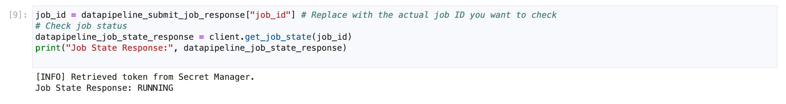
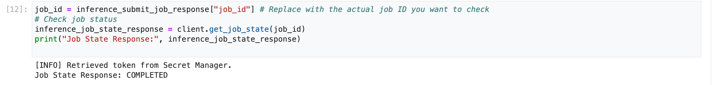
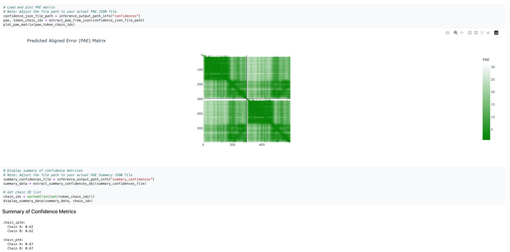

# Simple Ipynb Launcher

The Simple Ipynb Launcher is a Jupyter Notebook-based interface designed to streamline the process of running AlphaFold 3 jobs through a SLURM-based cluster using the SLURM REST API.

It allows users to:

- Upload AlphaFold 3 input files (see [AlphaFold 3 Input Documentation](https://github.com/google-deepmind/alphafold3/blob/main/docs/input.md)),
- Launch data pipeline and/or inference jobs, and
- View and validate output files — all within a Jupyter Notebook environment.

## Prerequisites

### Set up Jobs Bucket

If you want to use the simple service launcher, you need to create an additional bucket, that should
be located in the region where you stand up your cluster:

```bash
#!/bin/bash

UNIQUE_JOB_BUCKET=<your-bucket>
PROJECT_ID=<your-gcp-project>
REGION=<your-preferred-region>

gcloud storage buckets create gs://${UNIQUE_JOB_BUCKET} \
    --project=${PROJECT_ID} \
    --default-storage-class=STANDARD --location=${REGION} \
    --uniform-bucket-level-access
```

### Activate Ipynb Launcher

To start the Simple Ipynb Launcher, ensure that the following settings are present in your `af3-slurm-deployment.yaml` file:

```yaml
af3ipynb_bucket: "<your-pre-existing-bucket>"
af3ipynb_user: af3ipynb
```

### Configuring the SLURM REST API Token Secret Name

Replace <your-secret-name> with the actual name of a secret you have created in Secret Manager that currently exists without a token value. Alternatively, you can provide the secret name that does not yet exist in Secret Manager. If the specified secret name is new, this blueprint will automatically create it for you.

> This setting allows you to specify the name of a Google Cloud Secret Manager secret that holds your SLURM authentication token. Using Secret Manager is a secure way to manage sensitive credentials.

```yaml
secret_name: "<your-secret-name>"
```

### Startup Script Completion Before Slurm API Requests

To ensure proper cluster initialization, please wait for the startup scripts to complete successfully on all relevant nodes (including login and controller nodes) **before submitting any Slurm API requests from the notebook**.

**How to Verify Startup Script Completion:**

You can check the `/var/log/slurm/setup.log` file on each node to confirm the successful execution of the startup script. Look for one of the following log entries, indicating completion for the respective node type:

- **Login Node Completion:**

  ```text
  INFO: Done setting up login
  ```

  This message confirms that the startup script on a login node has finished its configuration.

- **Controller Node Completion:**

  ```text
  INFO: Done setting up controller
  ```
  
  This message confirms that the startup script on a controller node has finished its configuration.

Make sure you submitting Slurm API requests only after the appropriate "Done setting up" message is observed on all necessary login and controller nodes. Monitoring these log files allows you to track the initialization process of your cluster.

## How It Works

**1. Uploading the Input Data:**

Begin by uploading your input JSON file, which contains the data required by AlphaFold, either `datapipeline` or `inference` input file, to the Jupyter Notebook environment. You can usually do this using the file upload feature available within the notebook interface.

   

**2. Running the Setup Cells (including System Configuration and SLURM Initialization):**

Once the input file is uploaded, execute all the cells in the notebook that are responsible for setting up the environment, installing dependencies, and loading necessary functions. Ensure all these setup cells run without errors before proceeding to the next section.

These cells perform several crucial setup tasks:

- **Installing dependencies:** For running the notebook for the first time, make sure to install the required dependencies. This step ensures that all necessary libraries are available for the notebook to function properly.

   

- **Review System Settings:** These cells display the default configurations for SLURM partitions (Datapipeline C3DH, Inference G2/A2/A2U), memory, CPU counts, and timeout durations. While you can modify the `af3_config` later if needed, reviewing these defaults is important.

  

- **Understand Science Settings:** These cells define scientific parameters for the model, such as seeds and iterations. Leaving them empty will apply AlphaFold’s default settings.

  

- **SLURM API Token Retrieval:** This cell outlines how the SLURM REST API token is retrieved from Google Secret Manager.

   

- **Hostname Retrieval:** This cell retrieve SLURM connection details (like hostname/remote IP address) from a local JSON file.

   

- **Initialize AF3SlurmClient and Test Connection:** The client is initialized, and a "Ping" command is executed to verify the connection to the SLURM REST API. A successful ping response confirms that the communication is working correctly.

   

**3. Configuring the Data Pipeline:**

- Replace the `input_file` within the data pipeline cell with JSON file path you uploaded in Step 1.

   

- After updating the filename, run the data pipeline cell. This will process your input data.
- Check job status:

   

**4. Executing the Inference:**

- Next, locate and execute the inference cell in the notebook. This cell is configured to use the **latest output** generated by the data pipeline as its input.

   > [WARNING]
   > Make sure the previous **Data Pipeline** process status is **"COMPLETED"** before running the current step, especially if you intend to run the workflow as an end-to-end process.

  If you prefer to run inference on a manually uploaded file, you can replace the default input `inference_input_file` variable with your own file path. Make sure that your uploaded file meets all the necessary requirements for the inference process to run correctly.

   

- Upon successful execution, the inference cell will perform the necessary calculations to predict the 3D structure and generate the PAE (Predicted Alignment Error) matrix.

- Check job status:
  

**5. Visualizing the Results:**

After the inference step is complete, the notebook should contain sections that allow you to visualize the results:

- **3D Structure:** You should be able to view an interactive 3D representation of the predicted structure.

   

- **PAE Matrix:** A visual representation of the PAE matrix will likely be displayed, providing insights into the model's confidence in the predicted relative positions of residues.

   

By following these steps, you can successfully run the end-to-end inference pipeline and visualize the predicted 3D structure and PAE matrix using the provided Jupyter Notebook.

## Custom configuration

You can customize settings via blueprint variables before deployment. If modifications are needed later, ensure:

- All required resources are available
- Configuration changes within the notebook are validated before submitting new jobs.
