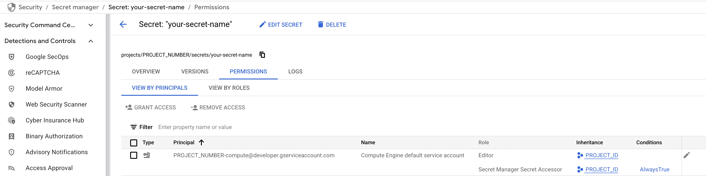
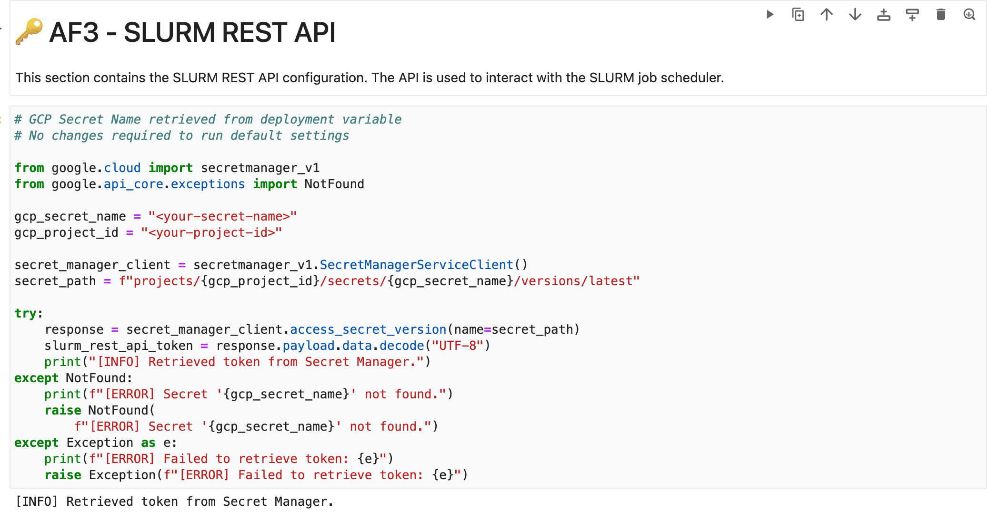

# Setup
This guide explains how to properly set up and launch the Simple Ipynb Launcher environment
## Prerequisites

### Set up Jobs Bucket

If you want to use the simple service launcher, you need to create an additional bucket, that should
be located in the region where you stand up your cluster:

```bash
#!/bin/bash

UNIQUE_JOB_BUCKET=<your-bucket>
PROJECT_ID=<your-gcp-project>
REGION=<your-preferred-region>

gcloud storage buckets create gs://${UNIQUE_JOB_BUCKET} \
    --project=${PROJECT_ID} \
    --default-storage-class=STANDARD --location=${REGION} \
    --uniform-bucket-level-access
```

## Deploying a Jupyter Notebook for AlphaFold

You can deploy a Jupyter Notebook environment to run AlphaFold step-by-step. This is useful for interactive exploration and making custom modifications to the AlphaFold pipeline.

> **Important:** To enable the Jupyter Notebook deployment, you **must provide a cloud storage bucket**. If no bucket is specified, the notebook environment will not be created.

### Configuring the SLURM REST API Token Secret Manager

Replace `slurm_rest_token_secret_name` value in the `af3-slurm-deployment.yaml` with the name of an existing secret in Secret Manager. Alternatively, you can specify a name for a secret that does not yet exist. If the specified secret name is new, this blueprint will automatically create it for you.

> This setting allows you to specify the name of a Google Cloud Secret Manager secret that holds your SLURM authentication token. Using Secret Manager is a secure way to manage sensitive credentials.

```yaml
slurm_rest_token_secret_name: "<your-secret-name>"
```

### Steps to Deploy

1. Ensure you have provided a valid cloud storage bucket in your `af3-slurm-deployment.yaml`:

    ```yaml
    af3ipynb_bucket: "<your-pre-existing-bucket-name>"
    ```

2. If you have already deployed the cluster (see [Deploy the Cluster](#deploy-the-cluster)) **without specifying** the `af3ipynb_bucket` in your `af3-slurm-deployment.yaml` file and now wish to enable the Jupyter Notebook functionality, you must [**tear down the existing cluster**](#teardown-instructions) and [**redeploy a new cluster**](#deploy-the-cluster) with the correct `af3ipynb_bucket` value. Could follow `--skip image` command while deploying to reduce deployment time.
Note that the Jupyter Notebook will not function properly if added to an already deployed cluster without this configuration.

3. Build the Jupyter notebook with `af3-slurm-ipynb.yaml`:

    ```bash
    # Make sure you are under cluster-toolkit root folder
    ~$ cd cluster-toolkit  
    cluster-toolkit$ ./gcluster deploy -d examples/science/af3-slurm/af3-slurm-deployment.yaml examples/science/af3-slurm/examples/simple_ipynb_launcher/af3-slurm-ipynb.yaml --auto-approve
    ```

### Granting Access to the Token

  > Before running this section, please complete the [**Upload Notebook to Bucket**](#upload-notebook-to-bucket) section first.

  After the deploying steps are success, you must ensure that the appropriate service account (e.g., the default service account for the Compute Engine instance) has permission to access the secret. This step is crucial because, without access to the secret, the notebook will not be able to authenticate properly or send valid requests to the SLURM REST API.

  If you have not granted access yet, then run the following command, replacing `<your-secret-name>` and `<your-project-id>` with your values:

  ```bash
  gcloud secrets add-iam-policy-binding <your-secret-name> \
    --member="serviceAccount:$(gcloud projects describe <your-project-id> --format='value(projectNumber)')-compute@developer.gserviceaccount.com" \
    --role="roles/secretmanager.secretAccessor" \
    --condition="expression=true,title=AlwaysTrue,description=Allow access to Secret Manager"
  ```

  This command grants the Compute Engine default service account the `secretAccessor` role with a condition that always evaluates to true, as shown in the image below. You can view this in the `Secret Manager` page in the Google Cloud Console.

  

  This setting allows the notebook server to successfully retrieve the value of the specified secret by its name.

#### Verify Access

  To confirm that the service account has the necessary permissions, from the jupyter notebook workbench, you can open a terminal and run the following command:

  ```bash
  gcloud secrets versions access latest --secret=<your-secret-name>
  ```

  If the command succeeds, this confirms that your notebook can securely retrieve the authentication token from Secret Manager as shown in the image below.

   

### Startup Script Completion Before Slurm API Requests

To ensure proper cluster initialization, please wait for the startup scripts to complete successfully on all relevant nodes (including login and controller nodes) **before submitting any Slurm API requests from the notebook**.

**How to Verify Startup Script Completion:**

You can check the `/var/log/slurm/setup.log` file on each node to confirm the successful execution of the startup script. Look for one of the following log entries, indicating completion for the respective node type:

- **Login Node Completion:**

  ```text
  INFO: Done setting up login
  ```

  This message confirms that the startup script on a login node has finished its configuration.

- **Controller Node Completion:**

  ```text
  INFO: Done setting up controller
  ```
  
  This message confirms that the startup script on a controller node has finished its configuration.

Make sure you submitting Slurm API requests only after the appropriate "Done setting up" message is observed on all necessary login and controller nodes. Monitoring these log files allows you to track the initialization process of your cluster.

## Upload Notebook to Bucket

To upload the Jupyter notebook to the cloud storage bucket so it can be accessed via JupyterLab:

1. **SSH into controller node** in the cluster.

2. **Navigate to the setup directory**:

   ```bash
   cd /home/af3ipynb/ipynb_setup
   ```

3. Run the Ansible playbook to upload the Jupyter notebook and its required library files to the designated bucket:

    ```bash
    ansible-playbook ipynb-upload-config.yml
    ```

This playbook will upload `slurm-rest-api-notebook.ipynb` along with its associated scripts and library files to the target bucket (`af3ipynb_bucket`).
Once the upload is complete, you can access the notebook from the JupyterLab interface via:

> Cloud Console → Vertex AI → Workbench → Instances

## Custom configuration

You can customize settings via blueprint variables before deployment. If modifications are needed later, ensure:

- All required resources are available
- Configuration changes within the notebook are validated before submitting new jobs.

## Teardown Jupyter Notebook

If you would like to tear down the notebook deployment, use the command below.

```bash
./gcluster destroy af3-slurm-ipynb --auto-approve
```

> [!WARNING]
> If you do not destroy all three deployment groups and/or the notebook deployment, then there may be continued
> associated costs. Also, the buckets you may have created via the cloud console or CLI will
> not be destroyed by the above command (they would be, however, destroyed if you deleted the project).
> For deleting the buckets consult [Delete buckets](https://cloud.google.com/storage/docs/deleting-buckets).
